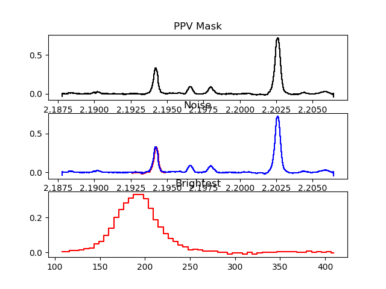

# CubeLineMoment

Script to derive Moment0, Moment1, and Moment2 from a set of input-defined spectral lines in an image cube. Currently simply calculates moments over a defined HWZI for each line specified.

## N.B.
1. It is important to keep in mind that one needs to set **sample_pixel** in order to get diagnostic plots, otherwise 
none will be produced. 
2. The **choice of sample pixel** is significant, and can impact the quality of the moment maps generated.
It is best to choose one of the strongest peaks in the intensity for the setup.

## Requirements

    aplpy
    pyspeckit
    spectral-cube
    radio-beam
    yaml

To run in ipython use:
```sh
% run CubeLineMoment.py yaml_scripts/CubeLineMomentInput.yaml
```
## YAML File Input Parameters:

**cube [string]:** Input FITS cube to be processed. Spectral axis can be frequency or velocity. Example: FITS/NGC253-H2COJ32K02-Feather-line.fits

**cuberegion [string]:** ds9 region file used to spatial mask for input FITS cube emission region. Example: regions/NGC253BoxBand6H2COJ32K02.reg

**cutoutcube [string]:** Input FITS cube which contains "tracer" transition which is strong and representative of dense gas emission region traced by other molecules/transitions in cube. Note that this cube can be any image cube, as long as the PPV range overlaps with cuberegion.  Example: FITS/NGC253-H213COJ32K1-Feather-line.fits

**cutoutcuberegion [string]:** ds9 region file used to spatial mask input FITS spatialmaskcube. Example: regions/NGC253BoxBand6H2COJ32K02.reg

**vz [float:km/s]:** Target central velocity. In order to maximize the effectiveness of the spectral lines extracted from your image cube, set vz to a value near the median radial velocity of your target. Example: 258.8

**target [string]:** Target name. Example: NGC253-H2COJ32K02

**brightest_line_frequency [float:MHz]:** Frequency of the bright "tracer" transition in spatialmaskcube. Example: 219.560358

**width_line_frequency [float:MHz]:** Frequency of the "representative" transition in cube. Example: 218.222192

**velocity_half_range [float:km/s]:** Estimated half-width at zero intensity for the entire velocity extent of the "representative" transition in cube. Note that for a galaxy this would be half of the total velocity range for the chosen transition. Example: 80

**noisemapbright_baseline [list of lists:channels]:** Baseline channel segments which are considered line-free in spatialmaskcube. Used to determine RMS spectral noise in spatialmaskcube. Example: [[40,60],[100,116],[150,180]]

**noisemap_baseline [list of lists:channels]:** Baseline channel segments which are considered line-free in cube. Used to determine RMS spectral noise in cube. Example: [[20,35],[60,95],[360,370]]

**my_line_list [list:MHz]:** List of spectral line frequencies to be extracted from cube. Example: 217.289800, 217.299162, 217.467150, 217.517110, 217.802057, 217.88639, 217.943821, 218.15897, 218.222192, 218.324711, 218.440050, 218.475632, 218.760071, 218.85439, 218.9033555, 218.981019

**my_line_widths [list:km/s]:** List of estimated half-width zero-intensities for transitions in my_line_list. Example: 50.0, 50.0, 60.0, 40.0, 40.0, 40.0, 40.0, 40.0, 40.0, 40.0, 40.0, 40.0, 40.0, 50.0, 40.0, 40.0

**my_line_names [list:string]:** List of transition names in my_line_list. Example: 13CNF122, CH3OH67, 13CNF132, CH3OCHO88, CH3OCHO4847, CH3OH2020, CH3OCHO4546, CH3OCHO??, H2COJ32K0, HC3N2423v0, CH3OH43, H2COJ32K221, H2COJ32K210, HC3N2423v6, OCS1817, HNCO109

**signal_mask_limit [float]:** Multiplier for noise-based signal masking. Signal less than signal_mask_limit times RMS noise is masked. Example: 2

**spatial_mask_limit [float]:** Multiplier for noise-based spatial masking. Signal less than spatial_mask_limit times RMS noise is masked. Example: 2

**sample_pixel [str, optional]:** A set of (x,y) coordinates to sample from the cutout cube to create diagnostic images.  Assumed to be in a ds9 regions file, and must be within the cutout image area.  If left as `None`, no diagnostic images will be made.  *Note that the choice of the diagnostic position is very important, as it allows you to diagnose how well you have set **my_line_widths**.

## Masking Used in CubeLineMoment:

* Create a cutout cube **cutoutcube** based on a bright line.
  * [optional] Select only positive values (set by **mask_negatives** parameter)
  * Select a subset of the cube at +/- **velocity_half_range** from the central velocity **vz**
  * Compute peak intensity **max_map**, **width width_map**, and peak velocity **peak_velocity** of this cube to use in future steps
* Create a noise map **noisemapbright** based on the bright line cube
  * Select signal-free baseline regions using the **noisemapline_baseline** parameter
  * Compute the standard deviation in the spectral direction of the selected region
* Create another noise map **noisemap** based on the target cube (the process is the same as for the bright cube)
* Create a spatial mask based on the peak intensity of the bright line cutout cube **cutoutcube** : pixels in the peak map **max_map** of the cutout cube above **signal_mask_limit * noisemapbright** are included
* Using the bright line maps, make a Gaussian mask cube **gauss_mask_cube** for each target line
* For each included spatial pixel, produce a Gaussian spectrum using the centroid from **peak_velocity**, the peak intensity from **max_map**, and the width from **width_map**
* Compute the peak signal-to-noise in each pixel by taking **max_map / noisemap**
* Determine a threshold that is **1/peak_sn**
* Create a PPV inclusion mask **width_mask_cube** where **gauss_mask_cube > threshold**
* [optional] Create a S/N mask where any PPV pixel is greater than **signal_mask_limit * noisemap** (this is a comparison between a cube and a spatial map)
* Create a PPV mask **velocity_range_mask** where the velocity is within **line_width** of **peak_velocity**
* Select the data combining the **velocity_range_mask**, the S/N limit, and the Gaussian-based **width_mask_cube**
* [optional] Use ds9 regions to select spatial regions to process (This should not be used, since it is not supported in later steps)

## Worked Example

In the following we will show how a typical run of **CubeLineMoment** will look.  For this example I am processing ALMA Band 6 measurements of NGC253 published in [Mangum etal (2019)](https://ui.adsabs.harvard.edu/link_gateway/2019ApJ...871..170M/doi:10.3847/1538-4357/aafa15).  Once I have edited my **yaml** file appropriately I can run **CubeLineMoment** as follows in ipython:

```python
In [2]: run CubeLineMoment.py yaml_scripts/NGC253-H2COJ32K02-CubeLineMomentInput.yaml
{'velocity_half_range': 150, 'cube': 'FITS/NGC253-H2COJ32K02-Feather-line.fits', 'my_line_list': <Quantity [217.2898   , 217.299162 , 217.46715  , 217.51711  , 217.802057 ,
           217.817663 , 217.88639  , 217.943821 , 218.15897  , 218.222192 ,
           218.324711 , 218.44005  , 218.475632 , 218.760071 , 218.85439  ,
           218.83701  , 218.875369 , 218.9033555, 218.981019 ] GHz>, 'my_line_widths': <Quantity [ 50.,  50., 110.,  40.,  60.,  70.,  50.,  70.,  40.,  70.,
            70., 100., 100.,  80.,  40.,  30.,  30.,  40.,  50.] km / s>, 'spatial_mask_limit': 2, 'sample_pixel': (207, 161), 'vz': 258.8, 'cutoutcuberegion': 'regions/NGC253BoxBand6H2COJ32K02.reg', 'target': 'NGC253-H2COJ32K02', 'noisemapbright_baseline': [[150, 180]], 'noisemap_baseline': [[360, 370]], 'cuberegion': 'regions/NGC253BoxBand6H2COJ32K02.reg', 'signal_mask_limit': 2, 'my_line_names': ['13CNF122', 'CH3OH67', '13CNF132', 'CH3OCHO88', 'CH3OCHO4847', 'SIS1211', 'CH3OH2020', 'CH3OCHO4546', 'CH3OCHO??', 'H2COJ32K0', 'HC3N2423v0', 'CH3OH43', 'H2COJ32K221', 'H2COJ32K210', 'HC3N2423v7', 'C4H23224745', 'C4H23224543', 'OCS1817', 'HNCOJ109K1'], 'width_line_frequency': 218.222192, 'brightest_line_frequency': 219.560358, 'cutoutcube': 'FITS/NGC253-H213COJ32K1-Feather-line.fits'}
/Users/jmangum/anaconda/lib/python2.7/site-packages/spectral_cube/masks.py:620: FutureWarning: Using a non-tuple sequence for multidimensional indexing is deprecated; use `arr[tuple(seq)]` instead of `arr[seq]`. In the future this will be interpreted as an array index, `arr[np.array(seq)]`, which will result either in an error or a different result.
  return LazyMask(self._function, data=self._data[view],
/Users/jmangum/anaconda/lib/python2.7/site-packages/spectral_cube/spectral_cube.py:1203: FutureWarning: Using a non-tuple sequence for multidimensional indexing is deprecated; use `arr[tuple(seq)]` instead of `arr[seq]`. In the future this will be interpreted as an array index, `arr[np.array(seq)]`, which will result either in an error or a different result.
  return self._new_cube_with(data=self._data[view],
WARNING: PossiblySlowWarning: This function (<function std at 0xb1cab7848>) requires loading the entire cube into memory and may therefore be slow. [spectral_cube.utils]
WARNING: PossiblySlowWarning: This function (<function argmax at 0xb1cab7de8>) requires loading the entire cube into memory and may therefore be slow. [spectral_cube.utils]
WARNING: PossiblySlowWarning: This function (<function max at 0xb1cab7b18>) requires loading the entire cube into memory and may therefore be slow. [spectral_cube.utils]
/Users/jmangum/anaconda/lib/python2.7/site-packages/spectral_cube/spectral_cube.py:381: RuntimeWarning: All-NaN slice encountered
  **kwargs)
/Users/jmangum/anaconda/lib/python2.7/site-packages/spectral_cube/_moments.py:169: RuntimeWarning: divide by zero encountered in true_divide
  np.nansum(data, axis=axis))
/Users/jmangum/anaconda/lib/python2.7/site-packages/spectral_cube/_moments.py:179: RuntimeWarning: divide by zero encountered in true_divide
  np.nansum(data, axis=axis))
/Users/jmangum/anaconda/lib/python2.7/site-packages/numpy/lib/nanfunctions.py:1545: RuntimeWarning: Degrees of freedom <= 0 for slice.
  keepdims=keepdims)
noisemapbright peak = 0.00502617144957 Jy / beam
INFO: Line: 13CNF122, 217.2898 GHz, 50.0 km / s [__main__]
CubeLineMoment.py:382: RuntimeWarning: divide by zero encountered in divide
  (2*np.array(width_map*width_map_scaling)[None,:,:]**2))
Peak S/N: 217.768218994
Highest Threshold: 1.46339130402
SP Threshold: 0.0105293663219
SP S, N, S/N: 0.329371035099 Jy / beam,0.00346806831658 Jy / beam,94.9724731445
Number of values above threshold: 835680
Max value in the mask cube: 0.999999999999
shapes: mask cube=(41, 360, 388)  threshold: (360, 388)
/Users/jmangum/anaconda/lib/python2.7/site-packages/matplotlib/cbook/deprecation.py:107: MatplotlibDeprecationWarning: Adding an axes using the same arguments as a previous axes currently reuses the earlier instance.  In a future version, a new instance will always be created and returned.  Meanwhile, this warning can be suppressed, and the future behavior ensured, by passing a unique label to each axes instance.
  warnings.warn(message, mplDeprecation, stacklevel=1)
/Users/jmangum/anaconda/lib/python2.7/site-packages/matplotlib/cbook/deprecation.py:107: MatplotlibDeprecationWarning: The mpl_toolkits.axes_grid module was deprecated in version 2.1. Use mpl_toolkits.axes_grid1 and mpl_toolkits.axisartist provies the same functionality instead.
  warnings.warn(message, mplDeprecation, stacklevel=1)
INFO: Auto-setting vmin to -7.159e-02 [aplpy.core]
INFO: Auto-setting vmax to  8.489e-01 [aplpy.core]
/Users/jmangum/anaconda/lib/python2.7/site-packages/aplpy/labels.py:432: UnicodeWarning: Unicode equal comparison failed to convert both arguments to Unicode - interpreting them as being unequal
  if self.coord == x or self.axis.apl_tick_positions_world[ipos] > 0:
Moment 0 for sample pixel is 0.555917441845 Jy km / (beam s)
INFO: Auto-setting vmin to  4.575e+01 [aplpy.core]
INFO: Auto-setting vmax to  2.976e+02 [aplpy.core]
Moment 1 for sample pixel is 190.149386986 km / s
INFO: Auto-setting vmin to -9.666e+00 [aplpy.core]
INFO: Auto-setting vmax to  1.073e+02 [aplpy.core]
Moment 2 for sample pixel is 52.3489028499 km / s
INFO: Line: CH3OH67, 217.299162 GHz, 50.0 km / s [__main__]
Peak S/N: 217.768218994
Highest Threshold: 1.46339130402
SP Threshold: 0.0105293663219
SP S, N, S/N: 0.329371035099 Jy / beam,0.00346806831658 Jy / beam,94.9724731445
Number of values above threshold: 915014
Max value in the mask cube: 0.999999999996
shapes: mask cube=(43, 360, 388)  threshold: (360, 388)

[...and so-on...truncated for clarity...]

In [3]:
```
<!---
INFO: Auto-setting vmin to -7.105e-02 [aplpy.core]
INFO: Auto-setting vmax to  8.432e-01 [aplpy.core]
Moment 0 for sample pixel is 0.555941402912 Jy km / (beam s)
INFO: Auto-setting vmin to  5.867e+01 [aplpy.core]
INFO: Auto-setting vmax to  3.105e+02 [aplpy.core]
Moment 1 for sample pixel is 203.074237212 km / s
INFO: Auto-setting vmin to -9.628e+00 [aplpy.core]
INFO: Auto-setting vmax to  1.069e+02 [aplpy.core]
Moment 2 for sample pixel is 52.3511587803 km / s
INFO: Line: 13CNF132, 217.46715 GHz, 110.0 km / s [__main__]
Peak S/N: 217.768218994
Highest Threshold: 1.46339130402
SP Threshold: 0.0105293663219
SP S, N, S/N: 0.329371035099 Jy / beam,0.00346806831658 Jy / beam,94.9724731445
Number of values above threshold: 1514444
Max value in the mask cube: 0.999999999985
shapes: mask cube=(96, 360, 388)  threshold: (360, 388)
INFO: Auto-setting vmin to -1.326e-01 [aplpy.core]
INFO: Auto-setting vmax to  1.623e+00 [aplpy.core]
Moment 0 for sample pixel is 1.32903194427 Jy km / (beam s)
INFO: Auto-setting vmin to  4.048e+01 [aplpy.core]
INFO: Auto-setting vmax to  4.891e+02 [aplpy.core]
Moment 1 for sample pixel is 220.606848067 km / s
INFO: Auto-setting vmin to -1.936e+01 [aplpy.core]
INFO: Auto-setting vmax to  2.149e+02 [aplpy.core]
Moment 2 for sample pixel is 85.6558332873 km / s
INFO: Line: CH3OCHO88, 217.51711 GHz, 40.0 km / s [__main__]
Peak S/N: 217.768218994
Highest Threshold: 1.46339130402
SP Threshold: 0.0105293663219
SP S, N, S/N: 0.329371035099 Jy / beam,0.00346806831658 Jy / beam,94.9724731445
Number of values above threshold: 1496938
Max value in the mask cube: 0.999999999998
shapes: mask cube=(71, 360, 388)  threshold: (360, 388)
INFO: Auto-setting vmin to -3.436e-02 [aplpy.core]
INFO: Auto-setting vmax to  5.185e-01 [aplpy.core]
Moment 0 for sample pixel is 0.0821091532707 Jy km / (beam s)
INFO: Auto-setting vmin to  5.680e+01 [aplpy.core]
INFO: Auto-setting vmax to  4.547e+02 [aplpy.core]
Moment 1 for sample pixel is 226.525288745 km / s
INFO: Auto-setting vmin to -7.746e+00 [aplpy.core]
INFO: Auto-setting vmax to  8.598e+01 [aplpy.core]
Moment 2 for sample pixel is 12.8994213562 km / s
INFO: Line: CH3OCHO4847, 217.802057 GHz, 60.0 km / s [__main__]
Peak S/N: 217.768218994
Highest Threshold: 1.46339130402
SP Threshold: 0.0105293663219
SP S, N, S/N: 0.329371035099 Jy / beam,0.00346806831658 Jy / beam,94.9724731445
Number of values above threshold: 1505825
Max value in the mask cube: 0.999999999997
shapes: mask cube=(78, 360, 388)  threshold: (360, 388)
INFO: Auto-setting vmin to -3.406e-01 [aplpy.core]
INFO: Auto-setting vmax to  3.839e+00 [aplpy.core]
Moment 0 for sample pixel is 3.85259103775 Jy km / (beam s)
INFO: Auto-setting vmin to  3.459e+01 [aplpy.core]
INFO: Auto-setting vmax to  4.730e+02 [aplpy.core]
Moment 1 for sample pixel is 171.391379555 km / s
INFO: Auto-setting vmin to -1.163e+01 [aplpy.core]
INFO: Auto-setting vmax to  1.291e+02 [aplpy.core]
Moment 2 for sample pixel is 49.8239288299 km / s
INFO: Line: SIS1211, 217.817663 GHz, 70.0 km / s [__main__]
Peak S/N: 217.768218994
Highest Threshold: 1.46339130402
SP Threshold: 0.0105293663219
SP S, N, S/N: 0.329371035099 Jy / beam,0.00346806831658 Jy / beam,94.9724731445
Number of values above threshold: 1509101
Max value in the mask cube: 0.999999999998
shapes: mask cube=(82, 360, 388)  threshold: (360, 388)
INFO: Auto-setting vmin to -3.527e-01 [aplpy.core]
INFO: Auto-setting vmax to  3.977e+00 [aplpy.core]
Moment 0 for sample pixel is 4.11435174942 Jy km / (beam s)
INFO: Auto-setting vmin to  3.961e+01 [aplpy.core]
INFO: Auto-setting vmax to  4.780e+02 [aplpy.core]
Moment 1 for sample pixel is 190.093490181 km / s
INFO: Auto-setting vmin to -1.348e+01 [aplpy.core]
INFO: Auto-setting vmax to  1.496e+02 [aplpy.core]
Moment 2 for sample pixel is 54.4744452255 km / s
INFO: Line: CH3OH2020, 217.88639 GHz, 50.0 km / s [__main__]
Peak S/N: 217.768218994
Highest Threshold: 1.46339130402
SP Threshold: 0.0105293663219
SP S, N, S/N: 0.329371035099 Jy / beam,0.00346806831658 Jy / beam,94.9724731445
Number of values above threshold: 1501463
Max value in the mask cube: 1.0
shapes: mask cube=(75, 360, 388)  threshold: (360, 388)
INFO: Auto-setting vmin to -1.467e-01 [aplpy.core]
INFO: Auto-setting vmax to  1.690e+00 [aplpy.core]
Moment 0 for sample pixel is 0.425600588322 Jy km / (beam s)
INFO: Auto-setting vmin to  5.403e+01 [aplpy.core]
INFO: Auto-setting vmax to  4.660e+02 [aplpy.core]
Moment 1 for sample pixel is 179.785428623 km / s
INFO: Auto-setting vmin to -1.054e+01 [aplpy.core]
INFO: Auto-setting vmax to  1.170e+02 [aplpy.core]
Moment 2 for sample pixel is 95.3301327687 km / s
INFO: Line: CH3OCHO4546, 217.943821 GHz, 70.0 km / s [__main__]
Peak S/N: 217.768218994
Highest Threshold: 1.46339130402
SP Threshold: 0.0105293663219
SP S, N, S/N: 0.329371035099 Jy / beam,0.00346806831658 Jy / beam,94.9724731445
Number of values above threshold: 1507954
Max value in the mask cube: 0.999999999999
shapes: mask cube=(82, 360, 388)  threshold: (360, 388)
INFO: Auto-setting vmin to -1.843e-01 [aplpy.core]
INFO: Auto-setting vmax to  2.102e+00 [aplpy.core]
Moment 0 for sample pixel is 2.09271860123 Jy km / (beam s)
INFO: Auto-setting vmin to  2.777e+01 [aplpy.core]
INFO: Auto-setting vmax to  4.711e+02 [aplpy.core]
Moment 1 for sample pixel is 200.351944081 km / s
INFO: Auto-setting vmin to -1.358e+01 [aplpy.core]
INFO: Auto-setting vmax to  1.508e+02 [aplpy.core]
Moment 2 for sample pixel is 49.4388925677 km / s
INFO: Line: CH3OCHO??, 218.15897 GHz, 40.0 km / s [__main__]
Peak S/N: 217.768218994
Highest Threshold: 1.46339130402
SP Threshold: 0.0105293663219
SP S, N, S/N: 0.329371035099 Jy / beam,0.00346806831658 Jy / beam,94.9724731445
Number of values above threshold: 1492808
Max value in the mask cube: 1.0
shapes: mask cube=(71, 360, 388)  threshold: (360, 388)
INFO: Auto-setting vmin to -8.417e-02 [aplpy.core]
INFO: Auto-setting vmax to  1.004e+00 [aplpy.core]
Moment 0 for sample pixel is 0.604684233665 Jy km / (beam s)
INFO: Auto-setting vmin to  5.019e+01 [aplpy.core]
INFO: Auto-setting vmax to  4.574e+02 [aplpy.core]
Moment 1 for sample pixel is 184.651178422 km / s
INFO: Auto-setting vmin to -8.352e+00 [aplpy.core]
INFO: Auto-setting vmax to  9.271e+01 [aplpy.core]
Moment 2 for sample pixel is 39.1370720278 km / s
INFO: Line: H2COJ32K0, 218.222192 GHz, 70.0 km / s [__main__]
Peak S/N: 217.768218994
Highest Threshold: 1.46339130402
SP Threshold: 0.0105293663219
SP S, N, S/N: 0.329371035099 Jy / beam,0.00346806831658 Jy / beam,94.9724731445
Number of values above threshold: 1505150
Max value in the mask cube: 1.0
shapes: mask cube=(81, 360, 388)  threshold: (360, 388)
INFO: Auto-setting vmin to -4.374e-01 [aplpy.core]
INFO: Auto-setting vmax to  5.022e+00 [aplpy.core]
Moment 0 for sample pixel is 5.76940584183 Jy km / (beam s)
INFO: Auto-setting vmin to  4.205e+01 [aplpy.core]
INFO: Auto-setting vmax to  4.680e+02 [aplpy.core]
Moment 1 for sample pixel is 199.007833812 km / s
INFO: Auto-setting vmin to -1.327e+01 [aplpy.core]
INFO: Auto-setting vmax to  1.474e+02 [aplpy.core]
Moment 2 for sample pixel is 65.9960834983 km / s
INFO: Line: HC3N2423v0, 218.324711 GHz, 70.0 km / s [__main__]
Peak S/N: 217.768218994
Highest Threshold: 1.46339130402
SP Threshold: 0.0105293663219
SP S, N, S/N: 0.329371035099 Jy / beam,0.00346806831658 Jy / beam,94.9724731445
Number of values above threshold: 1505664
Max value in the mask cube: 0.999999999999
shapes: mask cube=(82, 360, 388)  threshold: (360, 388)
INFO: Auto-setting vmin to -5.273e-01 [aplpy.core]
INFO: Auto-setting vmax to  5.920e+00 [aplpy.core]
Moment 0 for sample pixel is 7.11501169205 Jy km / (beam s)
INFO: Auto-setting vmin to  4.366e+01 [aplpy.core]
INFO: Auto-setting vmax to  4.656e+02 [aplpy.core]
Moment 1 for sample pixel is 197.584064525 km / s
INFO: Auto-setting vmin to -1.360e+01 [aplpy.core]
INFO: Auto-setting vmax to  1.510e+02 [aplpy.core]
Moment 2 for sample pixel is 57.7546362739 km / s
INFO: Line: CH3OH43, 218.44005 GHz, 100.0 km / s [__main__]
Peak S/N: 217.768218994
Highest Threshold: 1.46339130402
SP Threshold: 0.0105293663219
SP S, N, S/N: 0.329371035099 Jy / beam,0.00346806831658 Jy / beam,94.9724731445
Number of values above threshold: 1507466
Max value in the mask cube: 1.0
shapes: mask cube=(92, 360, 388)  threshold: (360, 388)
INFO: Auto-setting vmin to -5.976e-01 [aplpy.core]
INFO: Auto-setting vmax to  6.773e+00 [aplpy.core]
Moment 0 for sample pixel is 7.58758115768 Jy km / (beam s)
INFO: Auto-setting vmin to  5.530e+01 [aplpy.core]
INFO: Auto-setting vmax to  4.754e+02 [aplpy.core]
Moment 1 for sample pixel is 182.661134613 km / s
INFO: Auto-setting vmin to -1.752e+01 [aplpy.core]
INFO: Auto-setting vmax to  1.945e+02 [aplpy.core]
Moment 2 for sample pixel is 85.2087772716 km / s
INFO: Line: H2COJ32K221, 218.475632 GHz, 100.0 km / s [__main__]
Peak S/N: 217.768218994
Highest Threshold: 1.46339130402
SP Threshold: 0.0105293663219
SP S, N, S/N: 0.329371035099 Jy / beam,0.00346806831658 Jy / beam,94.9724731445
Number of values above threshold: 1506796
Max value in the mask cube: 0.999999999994
shapes: mask cube=(92, 360, 388)  threshold: (360, 388)
INFO: Auto-setting vmin to -5.559e-01 [aplpy.core]
INFO: Auto-setting vmax to  6.235e+00 [aplpy.core]
Moment 0 for sample pixel is 6.75740432739 Jy km / (beam s)
INFO: Auto-setting vmin to  3.015e+01 [aplpy.core]
INFO: Auto-setting vmax to  4.832e+02 [aplpy.core]
Moment 1 for sample pixel is 221.932366934 km / s
INFO: Auto-setting vmin to -1.742e+01 [aplpy.core]
INFO: Auto-setting vmax to  1.934e+02 [aplpy.core]
Moment 2 for sample pixel is 68.1470191034 km / s
INFO: Line: H2COJ32K210, 218.760071 GHz, 80.0 km / s [__main__]
Peak S/N: 217.768218994
Highest Threshold: 1.46339130402
SP Threshold: 0.0105293663219
SP S, N, S/N: 0.329371035099 Jy / beam,0.00346806831658 Jy / beam,94.9724731445
Number of values above threshold: 1503368
Max value in the mask cube: 0.999999999999
shapes: mask cube=(85, 360, 388)  threshold: (360, 388)
INFO: Auto-setting vmin to -2.320e-01 [aplpy.core]
INFO: Auto-setting vmax to  2.645e+00 [aplpy.core]
Moment 0 for sample pixel is 2.97680997849 Jy km / (beam s)
INFO: Auto-setting vmin to  3.618e+01 [aplpy.core]
INFO: Auto-setting vmax to  4.820e+02 [aplpy.core]
Moment 1 for sample pixel is 203.176015369 km / s
INFO: Auto-setting vmin to -1.557e+01 [aplpy.core]
INFO: Auto-setting vmax to  1.728e+02 [aplpy.core]
Moment 2 for sample pixel is 58.1467516481 km / s
INFO: Line: HC3N2423v7, 218.85439 GHz, 40.0 km / s [__main__]
Peak S/N: 217.768218994
Highest Threshold: 1.46339130402
SP Threshold: 0.0105293663219
SP S, N, S/N: 0.329371035099 Jy / beam,0.00346806831658 Jy / beam,94.9724731445
Number of values above threshold: 1487249
Max value in the mask cube: 1.0
shapes: mask cube=(70, 360, 388)  threshold: (360, 388)
INFO: Auto-setting vmin to -1.453e-01 [aplpy.core]
INFO: Auto-setting vmax to  1.694e+00 [aplpy.core]
Moment 0 for sample pixel is 2.06834769249 Jy km / (beam s)
INFO: Auto-setting vmin to  4.895e+01 [aplpy.core]
INFO: Auto-setting vmax to  4.532e+02 [aplpy.core]
Moment 1 for sample pixel is 193.425383665 km / s
INFO: Auto-setting vmin to -8.443e+00 [aplpy.core]
INFO: Auto-setting vmax to  9.372e+01 [aplpy.core]
Moment 2 for sample pixel is 49.2315050854 km / s
INFO: Line: C4H23224745, 218.83701 GHz, 30.0 km / s [__main__]
Peak S/N: 217.768218994
Highest Threshold: 1.46339130402
SP Threshold: 0.0105293663219
SP S, N, S/N: 0.329371035099 Jy / beam,0.00346806831658 Jy / beam,94.9724731445
Number of values above threshold: 1479045
Max value in the mask cube: 0.999999999999
shapes: mask cube=(67, 360, 388)  threshold: (360, 388)
INFO: Auto-setting vmin to -1.037e-01 [aplpy.core]
INFO: Auto-setting vmax to  1.229e+00 [aplpy.core]
Moment 0 for sample pixel is 1.37491583824 Jy km / (beam s)
INFO: Auto-setting vmin to  6.167e+01 [aplpy.core]
INFO: Auto-setting vmax to  4.621e+02 [aplpy.core]
Moment 1 for sample pixel is 184.169551012 km / s
INFO: Auto-setting vmin to -6.276e+00 [aplpy.core]
INFO: Auto-setting vmax to  6.967e+01 [aplpy.core]
Moment 2 for sample pixel is 32.8614673602 km / s
INFO: Line: C4H23224543, 218.875369 GHz, 30.0 km / s [__main__]
Peak S/N: 217.768218994
Highest Threshold: 1.46339130402
SP Threshold: 0.0105293663219
SP S, N, S/N: 0.329371035099 Jy / beam,0.00346806831658 Jy / beam,94.9724731445
Number of values above threshold: 1479234
Max value in the mask cube: 1.0
shapes: mask cube=(67, 360, 388)  threshold: (360, 388)
INFO: Auto-setting vmin to -1.102e-01 [aplpy.core]
INFO: Auto-setting vmax to  1.387e+00 [aplpy.core]
Moment 0 for sample pixel is 1.65153968334 Jy km / (beam s)
INFO: Auto-setting vmin to  6.514e+01 [aplpy.core]
INFO: Auto-setting vmax to  4.590e+02 [aplpy.core]
Moment 1 for sample pixel is 197.347187406 km / s
INFO: Auto-setting vmin to -6.380e+00 [aplpy.core]
INFO: Auto-setting vmax to  7.082e+01 [aplpy.core]
Moment 2 for sample pixel is 44.1720217012 km / s
INFO: Line: OCS1817, 218.9033555 GHz, 40.0 km / s [__main__]
Peak S/N: 217.768218994
Highest Threshold: 1.46339130402
SP Threshold: 0.0105293663219
SP S, N, S/N: 0.329371035099 Jy / beam,0.00346806831658 Jy / beam,94.9724731445
Number of values above threshold: 1486611
Max value in the mask cube: 0.999999999999
shapes: mask cube=(70, 360, 388)  threshold: (360, 388)
INFO: Auto-setting vmin to -1.115e-01 [aplpy.core]
INFO: Auto-setting vmax to  1.302e+00 [aplpy.core]
Moment 0 for sample pixel is 1.75993776321 Jy km / (beam s)
INFO: Auto-setting vmin to  5.879e+01 [aplpy.core]
INFO: Auto-setting vmax to  4.593e+02 [aplpy.core]
Moment 1 for sample pixel is 205.178225461 km / s
INFO: Auto-setting vmin to -8.271e+00 [aplpy.core]
INFO: Auto-setting vmax to  9.180e+01 [aplpy.core]
Moment 2 for sample pixel is 44.1690027633 km / s
INFO: Line: HNCOJ109K1, 218.981019 GHz, 50.0 km / s [__main__]
Peak S/N: 217.768218994
Highest Threshold: 1.46339130402
SP Threshold: 0.0105293663219
SP S, N, S/N: 0.329371035099 Jy / beam,0.00346806831658 Jy / beam,94.9724731445
Number of values above threshold: 1491353
Max value in the mask cube: 0.999999999993
shapes: mask cube=(73, 360, 388)  threshold: (360, 388)
INFO: Auto-setting vmin to -1.100e-01 [aplpy.core]
INFO: Auto-setting vmax to  1.279e+00 [aplpy.core]
Moment 0 for sample pixel is 1.13415062428 Jy km / (beam s)
INFO: Auto-setting vmin to  5.313e+01 [aplpy.core]
INFO: Auto-setting vmax to  4.739e+02 [aplpy.core]
Moment 1 for sample pixel is 194.066797223 km / s
INFO: Auto-setting vmin to -9.861e+00 [aplpy.core]
INFO: Auto-setting vmax to  1.095e+02 [aplpy.core]
Moment 2 for sample pixel is 41.6096770751 km / s

In [3]:
--->
As you can see, **CubeLineMoment** is very chatty.  We will likely cut this back this verbosity a bit at some point in the future.  Note that all of the warnings are ignorable, due to minor things like using NaNs for blanking in the input image cube.  What you should see how are a number of new directories: 

```sh
% ls
CubeLineMoment.py
DEBUG_plot_NGC253-H2COJ32K02_13CNF122_widthscale1.0_sncut2.0_widthcutscale1.0.png
DEBUG_plot_NGC253-H2COJ32K02_13CNF132_widthscale1.0_sncut2.0_widthcutscale1.0.png
DEBUG_plot_NGC253-H2COJ32K02_C4H23224543_widthscale1.0_sncut2.0_widthcutscale1.0.png
DEBUG_plot_NGC253-H2COJ32K02_C4H23224745_widthscale1.0_sncut2.0_widthcutscale1.0.png
DEBUG_plot_NGC253-H2COJ32K02_CH3OCHO4546_widthscale1.0_sncut2.0_widthcutscale1.0.png
DEBUG_plot_NGC253-H2COJ32K02_CH3OCHO4847_widthscale1.0_sncut2.0_widthcutscale1.0.png
DEBUG_plot_NGC253-H2COJ32K02_CH3OCHO88_widthscale1.0_sncut2.0_widthcutscale1.0.png
DEBUG_plot_NGC253-H2COJ32K02_CH3OCHO??_widthscale1.0_sncut2.0_widthcutscale1.0.png
DEBUG_plot_NGC253-H2COJ32K02_CH3OH2020_widthscale1.0_sncut2.0_widthcutscale1.0.png
DEBUG_plot_NGC253-H2COJ32K02_CH3OH43_widthscale1.0_sncut2.0_widthcutscale1.0.png
DEBUG_plot_NGC253-H2COJ32K02_CH3OH67_widthscale1.0_sncut2.0_widthcutscale1.0.png
DEBUG_plot_NGC253-H2COJ32K02_H2COJ32K0_widthscale1.0_sncut2.0_widthcutscale1.0.png
DEBUG_plot_NGC253-H2COJ32K02_H2COJ32K210_widthscale1.0_sncut2.0_widthcutscale1.0.png
DEBUG_plot_NGC253-H2COJ32K02_H2COJ32K221_widthscale1.0_sncut2.0_widthcutscale1.0.png
DEBUG_plot_NGC253-H2COJ32K02_HC3N2423v0_widthscale1.0_sncut2.0_widthcutscale1.0.png
DEBUG_plot_NGC253-H2COJ32K02_HC3N2423v7_widthscale1.0_sncut2.0_widthcutscale1.0.png
DEBUG_plot_NGC253-H2COJ32K02_HNCOJ109K1_widthscale1.0_sncut2.0_widthcutscale1.0.png
DEBUG_plot_NGC253-H2COJ32K02_OCS1817_widthscale1.0_sncut2.0_widthcutscale1.0.png
DEBUG_plot_NGC253-H2COJ32K02_SIS1211_widthscale1.0_sncut2.0_widthcutscale1.0.png
FITS
GaussfitGalaxies.py
README.md
diagnostics
moment0
moment1
moment2
regions
subcubes
yaml_scripts
torgo:mangum_galaxies-master jmangum$
```
The <span style="color:blue">diagnostics, moment0, moment1, moment2, and subcubes</span> directories have been created by **CubeLineMoment**.  These directories contain:
* **diagnostics:** Diagnostic plots of the spectrum extraction for each transition requested in the **yaml* input file which shows the masking used and an example gaussian fit to the respective transition.  For example, the diagnostic plot for the H2CO 3(03)-2(02) transition looks like this: -2(02) diagnotics")  Note how the gaussian fit to this transition would not have been very good.  A PPV masking diagnostic plot is also produced which looks like the following for the current example: 
* **moment0:** The derived zeroth moment (integrated intensity) images for each transition in FITS and png format.  The moment0 image from the current example looks like this: -2(02) moment0") This directory also contains several diagnostic FITS files which show the various masking parameters used: **CentroidMap**, **FWHMMap**, **MaxMap**, **NoiseMap**, **NoiseMapBright**, and **WidthMap**.
* **moment1:** The derived first moment (centroid velocity) images for each transition in FITS and png format.  The moment1 image from the current example looks like this: -2(02) moment1")
* **moment2:** The derived second moment (velocity width) images for each transition in FITS and png format.  The moment2 image from the current example looks like this: -2(02) moment2")
* **subcubes:** The derived subcubes for each transition derived using the specified masking in FITS format.  In other words, these are single-transition spectral line cubes of all transitions requested in the input **yaml** file.


```python

```
