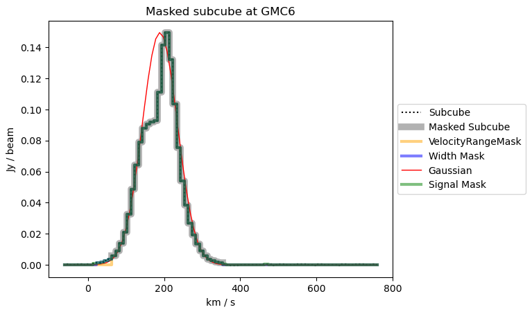
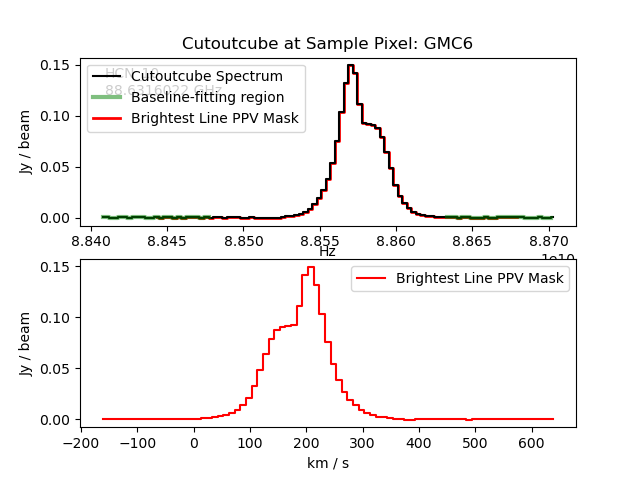
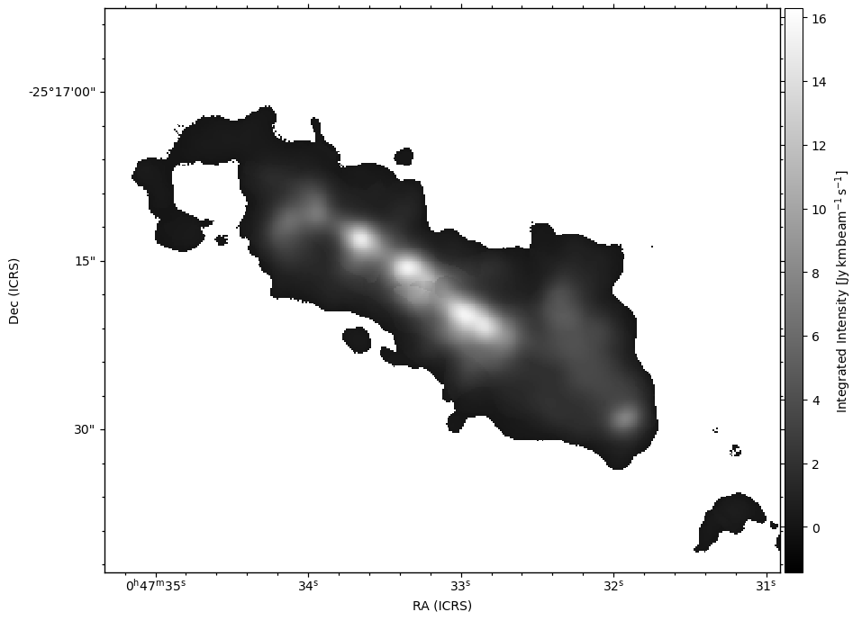
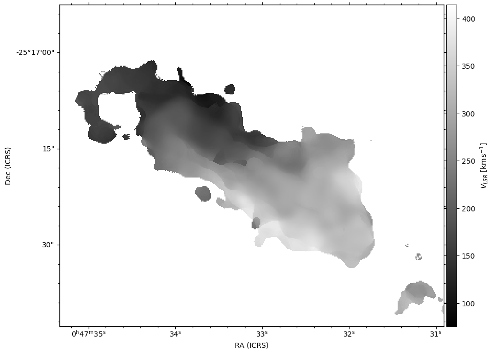
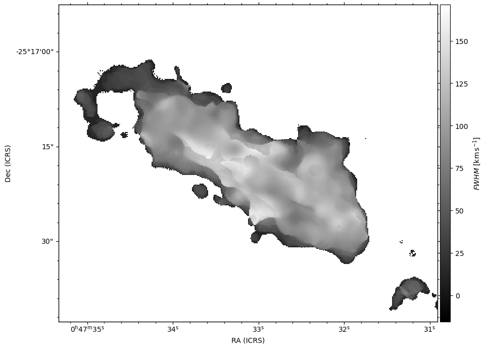

# CubeLineMoment

Script to derive Moment0, Moment1, and Moment2 from a set of input-defined spectral lines in an image cube. Currently simply calculates moments over a defined HWZI for each line specified.

## N.B.
1. It is important to keep in mind that one needs to set `sample_pixel` in order to get diagnostic plots, otherwise 
none will be produced. 
2. The **choice of sample pixel(s)** is significant, and can impact the quality of the moment maps generated.
It is best to choose one or more of the strongest peaks in the intensity for diagnostic calculation and display (see below).
3. Regarding the choise of `cutoutcube`, if you are extracting moments from relative strong spectral line(s), setting `cutoutcube` equal to `cube` is the best option.  If, on the other hand, your spectral line(s) of interest are weak, choose a `cutoutcube` with a bright spectral line that can be used to guide the extraction of moments for your spectral line(s) of interest.

## Requirements

    aplpy
    pyspeckit
    spectral-cube
    radio-beam
    yaml

To run in ipython use:
```sh
% run CubeLineMoment.py yaml_scripts/CubeLineMomentInput.yaml
```

## YAML File Input Parameters:

 - `cube` [string]: Input FITS cube to be processed.  Spectral axis can be
   frequency or velocity.
   Example: FITS/NGC253-H2COJ32K02-Feather-line.fits

 - `cuberegion` [string]: ds9 region file used to spatial mask for input FITS
   `cube` emission region.
   Example: regions/NGC253BoxBand6H2COJ32K02.reg

 - `cutoutcube` [string]: Input FITS cube which contains "tracer"
   transition which is strong and representative of dense gas emission
   region traced by other molecules/transitions in `cube`.  Note that this
   `cube` can be any image cube, as long as the PPV range overlaps with `cuberegion`.
   Example: FITS/NGC253-H213COJ32K1-Feather-line.fits

 - `cutoutcuberegion` [string]: ds9 region file used to spatial
   mask input FITS "tracer" transition (`spatialmaskcube`).
   Example: regions/NGC253BoxBand6H2COJ32K02.reg

 - `vz` [float:km/s]: Target central velocity.  In order to maximize the
   effectiveness of the spectral lines extracted from your image cube,
   set `vz` to a value near the median radial velocity of your target.
   Example: 258.8

 - `target` [string]: Target name.
   Example: NGC253

 - `brightest_line_name` [string]: Brightest line name.
   Example: 13CO_21

 - `brightest_line_frequency` [float:MHz]: Frequency of the bright
   "tracer" transition in `spatialmaskcube`.
   Example: 220.398700

 - `width_line_frequency` [float:MHz]: Frequency of the "representative"
   transition in cube.
   Example: 218.222192

 - `velocity_half_range` [float:km/s]: Estimated half-width at zero
   intensity for the entire velocity extent of the "representative"
   transition in `cube`.  Note that for a galaxy this would be half of
   the total velocity range for the chosen transition.
   Example: 400

 - `noisemapbright_baseline` [list of lists:channels]: Baseline channel segments
   which are considered line-free in `spatialmaskcube`.  Used to
   determine RMS spectral noise in `spatialmaskcube`.
   Example: [[40,60],[100,116],[150,180]]
   
 - `noisemap_baseline` [list of lists:channels]: Baseline channel segments
   which are considered line-free in `cube`.  Used to determine RMS
   spectral noise in `cube`.
   Example: [[20,35],[60,95],[360,370]]

 - `my_line_list` [list:MHz]: List of spectral line frequencies to be
   extracted from `cube`.
   Example: 217.289800, 217.299162, 217.467150, 217.517110, 217.802057, 217.88639, 217.943821, 218.15897, 218.222192, 218.324711, 218.440050, 218.475632, 218.760071, 218.85439, 218.9033555, 218.981019

 - `my_line_widths` [list:km/s]: List of estimated half-width
   zero-intensities for transitions in `my_line_list`.
   Example: 50.0, 50.0, 60.0, 40.0, 40.0, 40.0, 40.0, 40.0, 40.0, 40.0, 40.0, 40.0, 40.0, 50.0, 40.0, 40.0

 - `my_line_names` [list:string]: List of transition names in `my_line_list`.
   Example: 13CNF122, CH3OH67, 13CNF132, CH3OCHO88, CH3OCHO4847, CH3OH2020, CH3OCHO4546, CH3OCHO??, H2COJ32K0, HC3N2423v0, CH3OH43, H2COJ32K221, H2COJ32K210, HC3N2423v6, OCS1817, HNCO109

 - `signal_mask_limit` [float]: Multiplier for noise-based signal
   masking.  Signal less than `signal_mask_limit` times RMS noise is
   masked. 
   Example: 3

 - `spatial_mask_limit` [float]: Multiplier for noise-based spatial
   masking.  Signal less than `spatial_mask_limit` times RMS noise is
   masked. 
   Example: 3

 - `sample_pixel` [string]: File name for ds9 regions file that contains
   the sample pixel positions.  Regions file entries must be of type "point"
   (i.e. point(11.88341,-25.29118) # text={GMC1})
   Example: LeroyNGC253GMCPoint.reg


## Masking Used in CubeLineMoment

* [optional] Use ds9 regions to select spatial regions to process

* Create a cutout cube `cutoutcube` based on a bright line.
  - [optional] Select only positive values (set by `mask_negatives` parameter)
  - Select a subset of the cube at +/- `velocity_half_range` from 
    the central velocity `vz`
  - Compute peak intensity `max_map`, width `width_map`, and peak velocity
    `peak_velocity` of this cube to use in future steps

* Create a noise map `noisemapbright` based on the bright line cube
  - Select signal-free baseline regions using the `noisemapline_baseline` parameter
  - Compute the standard deviation in the spectral direction of the selected region

* Create another noise map `noisemap` based on the target cube (the process is
  the same as for the bright cube)

* Create a spatial mask based on the peak intensity of the bright line cutout cube `cutoutcube`:
  pixels in the peak map `max_map` of the cutout cube above `signal_mask_limit` *
  `noisemapbright` are included

* Using the bright line maps, make a Gaussian mask cube `gauss_mask_cube` for each target line
 - For each included _spatial_ pixel, produce a Gaussian spectrum using the centroid
 from `peak_velocity`, the peak intensity from `max_map`, and the width from `width_map`
 - Compute the peak signal-to-noise in each pixel by taking `max_map` / `noisemap`
 - Determine a threshold that is 1/`peak_sn`
 - Create a PPV inclusion mask `width_mask_cube` where `gauss_mask_cube` > `threshold`

* [optional] Create a S/N mask where any PPV pixel is greater than
  `signal_mask_limit` * `noisemap` (this is a comparison between a cube and a
  spatial map)

* Create a PPV mask `velocity_range_mask` where the velocity is within
  `line_width` of `peak_velocity`

* Select the data combining the `velocity_range_mask`, the S/N limit, and the
  Gaussian-based `width_mask_cube`


## Warning Messages

Note that several of these warning messages are due to the use of `NaN` values as blanking values in spectral cubes.  All of these warnings are for information only and can safely be ignored.


```
WARNING: StokesWarning: Cube is a Stokes cube, returning spectral cube for I component [spectral_cube.io.core]
```
Explanation: Cube contains a fourth `Stokes` axis.  Information only.  No action required.


```
WARNING: PossiblySlowWarning: This function (<function BaseSpectralCube.std at 0x19e9053a0>) requires loading the entire cube into memory and may therefore be slow. [spectral_cube.utils]
```
Explanation: `CubeLineMoment` does some calculation on entire cubes.  Information only.  No action required.


```
/Users/jmangum/anaconda3/envs/python39/lib/python3.9/site-packages/numpy/lib/nanfunctions.py:1878: RuntimeWarning: Degrees of freedom <= 0 for slice.
  var = nanvar(a, axis=axis, dtype=dtype, out=out, ddof=ddof,
```
Explanation: There is at least one spectrum that consists of only 1 pixel, so the standard deviation can't be computed. i.e., `noisemask.with_mask(mask[:,None,None]).include().sum(axis=0)` will have at least one pixel with value 1.  Information only.  No action required.


```
/Users/jmangum/anaconda3/envs/python39/lib/python3.9/site-packages/spectral_cube/spectral_cube.py:441: RuntimeWarning: All-NaN slice encountered
```
Explanation: This warning often results from the calculation of the maximum value along the spectral axis toward each pixel in `cutoutcube`.  Since
`cutoutcube` can have blanked (`NaN`) values, there is often at least one position where all spectral values are blanked (`NaN`).  Information only.  No action required.


```
/Users/jmangum/Python/mangum_galaxies-master/CubeLineMoment.py:435: RuntimeWarning: divide by zero encountered in divide
```
Explanation: This warning results from the fact that the denominator in a divide uses a cube with `NaN` values.  Since it is common for a cube to use `NaN` as a blanking value, this warning is common.  Information only.  No action required.


## Worked Example

In the following we will show how a typical run of **CubeLineMoment** will look.  For this example I am processing an ALMA Band 3 measurement from the ALCHEMI large programme imaging of NGC253 [see Martin etal (2021)](https://ui.adsabs.harvard.edu/abs/2021A%26A...656A..46M/abstract).  Once I have edited my **yaml** file appropriately, it looks like the following:
```python
cube: /Users/jmangum/Science/ALCHEMI/ScienceProjects/HCNHNC/createCubes/ngc253.88632MHz.HCN.1-0.regrid.12mC12mE.image.pbcor.fits
cuberegion: CubeLineMoment.reg
cutoutcube: /Users/jmangum/Science/ALCHEMI/ImageCubes/B6c/ngc253.B6c.sc4_1.12m7m.220300.contsub.cv01_6.cube.fits
cutoutcuberegion: CubeLineMoment.reg
vz: 236
target: NGC253
brightest_line_name: 13CO_21
brightest_line_frequency: 220.398700
width_line_frequency: 88.6316022
velocity_half_range: 400
noisemapbright_baseline: [[0,70],[170,232]]
noisemap_baseline: [[0,24],[77,100]]
my_line_list: 88.6316022
my_line_widths: 150
my_line_names: HCN_10
signal_mask_limit: 3
spatial_mask_limit: 3
sample_pixel: LeroyNGC253GMCPoint.reg
```
...where you can see that I am using the 13CO 2-1 transition as a my bright "tracer" transition.  The **CubeLineMoment.reg** and **LeroyNGC253GMCPoint.reg** regions files look like the following...
```python
# Region file format: DS9 version 4.1
global color=green dashlist=8 3 width=1 font="helvetica 10 normal roman" select=1 highlite-1 dash=0 fixed=0 edit=1 move=1 delete=1 source=1 include=1
fk5
box(00:47:33.120,-25:17:17.59,60.0",50.0",0)
```

```python
# Region file format: DS9 version 4.1
global color=black dashlist=8 3 width=1 font="helvetica 10 normal roman" select=1 highlite=1 dash=0 fixed=0 edit=1 move=1 delete=1 include=1 source=1
fk5
point(11.88341,-25.29118) # text={GMC1}
point(11.88449,-25.28895) # text={GMC2}
point(11.88669,-25.28932) # text={GMC3}
point(11.88739,-25.28888) # text={GMC4}
point(11.88838,-25.28817) # text={GMC5}
point(11.88888,-25.28771) # text={GMC6}
point(11.89018,-25.28702) # text={GMC7}
point(11.89176,-25.28650) # text={GMC8}
point(11.89236,-25.28674) # text={GMC9}
point(11.89265,-25.28551) # text={GMC10}
```

I can run **CubeLineMoment** as follows in ipython:

```python
In [2]: run CubeLineMoment.py yaml_scripts/HCN10.yaml
WARNING: StokesWarning: Cube is a Stokes cube, returning spectral cube for I component [spectral_cube.io.core]
WARNING: StokesWarning: Cube is a Stokes cube, returning spectral cube for I component [spectral_cube.io.core]
WARNING: PossiblySlowWarning: This function (<function BaseSpectralCube.std at 0x19e9053a0>) requires loading the entire cube into memory and may therefore be slow. [spectral_cube.utils]
WARNING: PossiblySlowWarning: This function (<function BaseSpectralCube.argmax at 0x19e905a60>) requires loading the entire cube into memory and may therefore be slow. [spectral_cube.utils]
WARNING: PossiblySlowWarning: This function (<function BaseSpectralCube.max at 0x19e905700>) requires loading the entire cube into memory and may therefore be slow. [spectral_cube.utils]
/Users/jmangum/anaconda3/envs/python39/lib/python3.9/site-packages/spectral_cube/spectral_cube.py:441: RuntimeWarning: All-NaN slice encountered
  out = function(self._get_filled_data(fill=fill,
WARNING: PossiblySlowWarning: This function (<function BaseSpectralCube.std at 0x19e9053a0>) requires loading the entire cube into memory and may therefore be slow. [spectral_cube.utils]
/Users/jmangum/anaconda3/envs/python39/lib/python3.9/site-packages/numpy/lib/nanfunctions.py:1878: RuntimeWarning: Degrees of freedom <= 0 for slice.
  var = nanvar(a, axis=axis, dtype=dtype, out=out, ddof=ddof,
noisemapbright peak = 0.07810217142105103 Jy / beam
WARNING: PossiblySlowWarning: This function (<function BaseSpectralCube.std at 0x19e9053a0>) requires loading the entire cube into memory and may therefore be slow. [spectral_cube.utils]
INFO: Line: HCN_10, 88.6316022 GHz, 150.0 km / s [__main__]
/Users/jmangum/Python/mangum_galaxies-master/CubeLineMoment.py:445: RuntimeWarning: divide by zero encountered in divide
  gauss_mask_cube = np.exp(-(np.array(centroid_map)[None,:,:] -
Peak S/N: 6634.828125
Highest Threshold: 0.11311683803796768
Sample Pixel =  (299, 95)
SP Threshold: 0.018084345385432243
SP S, N, S/N: 0.013217752799391747 Jy / beam, 0.00023903441615402699 Jy / beam, 55.296443939208984
Sample Pixel =  (275, 149)
SP Threshold: 0.03061608038842678
SP S, N, S/N: 0.005795983597636223 Jy / beam, 0.00017745028890203685 Jy / beam, 32.662574768066406
Sample Pixel =  (228, 140)
SP Threshold: 0.002327774418517947
SP S, N, S/N: 0.08278271555900574 Jy / beam, 0.00019269948825240135 Jy / beam, 429.5948791503906
Sample Pixel =  (212, 150)
SP Threshold: 0.002027489012107253
SP S, N, S/N: 0.10327742248773575 Jy / beam, 0.00020939383830409497 Jy / beam, 493.2209167480469
Sample Pixel =  (191, 167)
SP Threshold: 0.0004447655810508877
SP S, N, S/N: 0.46902844309806824 Jy / beam, 0.0002086077001877129 Jy / beam, 2248.37548828125
Sample Pixel =  (180, 178)
SP Threshold: 0.00015731400344520807
SP S, N, S/N: 1.14044189453125 Jy / beam, 0.0001794074778445065 Jy / beam, 6356.71337890625
Sample Pixel =  (152, 195)
SP Threshold: 0.0005626941565424204
SP S, N, S/N: 0.34190449118614197 Jy / beam, 0.0001923876698128879 Jy / beam, 1777.164306640625
Sample Pixel =  (118, 207)
SP Threshold: 0.0032989103347063065
SP S, N, S/N: 0.06636690348386765 Jy / beam, 0.00021893846860621125 Jy / beam, 303.1304016113281
Sample Pixel =  (105, 202)
SP Threshold: 0.014521691016852856
SP S, N, S/N: 0.016176709905266762 Jy / beam, 0.00023491318279411644 Jy / beam, 68.86250305175781
Sample Pixel =  (98, 231)
SP Threshold: 0.00669202720746398
SP S, N, S/N: 0.033527083694934845 Jy / beam, 0.00022436416475102305 Jy / beam, 149.43154907226562
Number of values above threshold: 966577
Max value in the mask cube: 0.9999999998971579
shapes: mask cube=(84, 334, 400)  threshold: (334, 400)
INFO: Auto-setting vmin to -1.406e+00 [aplpy.core]
INFO: Auto-setting vmax to  1.572e+01 [aplpy.core]
Moment 0 for sample pixel GMC1 is 0.038473427295684814 Jy km / (beam s)
Moment 0 for sample pixel GMC2 is 0.05575093626976013 Jy km / (beam s)
Moment 0 for sample pixel GMC3 is 0.7805874943733215 Jy km / (beam s)
Moment 0 for sample pixel GMC4 is 2.0649075508117676 Jy km / (beam s)
Moment 0 for sample pixel GMC5 is 7.018716335296631 Jy km / (beam s)
Moment 0 for sample pixel GMC6 is 15.309162139892578 Jy km / (beam s)
Moment 0 for sample pixel GMC7 is 5.89843225479126 Jy km / (beam s)
Moment 0 for sample pixel GMC8 is 1.885023593902588 Jy km / (beam s)
Moment 0 for sample pixel GMC9 is 0.6924808621406555 Jy km / (beam s)
Moment 0 for sample pixel GMC10 is 0.6177182197570801 Jy km / (beam s)
INFO: Auto-setting vmin to  2.541e+01 [aplpy.core]
INFO: Auto-setting vmax to  4.588e+02 [aplpy.core]
Moment 1 for sample pixel GMC1 is 65.88854994165774 km / s
Moment 1 for sample pixel GMC2 is 99.36496316279107 km / s
Moment 1 for sample pixel GMC3 is 145.45380971293133 km / s
Moment 1 for sample pixel GMC4 is 155.32549505714815 km / s
Moment 1 for sample pixel GMC5 is 179.89369183364863 km / s
Moment 1 for sample pixel GMC6 is 188.2582229211131 km / s
Moment 1 for sample pixel GMC7 is 274.61271265651504 km / s
Moment 1 for sample pixel GMC8 is 342.81658611197463 km / s
Moment 1 for sample pixel GMC9 is 253.64777774996247 km / s
Moment 1 for sample pixel GMC10 is 365.3522476425767 km / s
INFO: Auto-setting vmin to -1.606e+01 [aplpy.core]
INFO: Auto-setting vmax to  1.783e+02 [aplpy.core]
Moment 2 for sample pixel GMC1 is 18.252890407904523 km / s
Moment 2 for sample pixel GMC2 is 30.425886040335453 km / s
Moment 2 for sample pixel GMC3 is 89.13857699270842 km / s
Moment 2 for sample pixel GMC4 is 90.66588556800252 km / s
Moment 2 for sample pixel GMC5 is 118.54172350590706 km / s
Moment 2 for sample pixel GMC6 is 112.36025197665448 km / s
Moment 2 for sample pixel GMC7 is 141.10130367729795 km / s
Moment 2 for sample pixel GMC8 is 140.1128437520198 km / s
Moment 2 for sample pixel GMC9 is 131.76574974010254 km / s
Moment 2 for sample pixel GMC10 is 78.98769056488635 km / s
In [3]:
```

As you can see, **CubeLineMoment** is very chatty.  We will likely cut this back this verbosity a bit at some point in the future.  Note that all of the warnings are ignorable (see [Masking Used in CubeLineMoment](#masking-used-in-cubelinemoment)), due to minor things like using NaNs for blanking in the input image cube.  What you should see how are a number of new directories: 

```sh
% ls *.png
DEBUG_plot_NGC253_HCN_10_widthscale1.0_sncut3.0_widthcutscale1.0.png
```

...and there should be five new directories...
```
diagnostics
moment0
moment1
moment2
subcubes
```
The <span style="color:blue">diagnostics, moment0, moment1, moment2, and subcubes</span> directories have been created by **CubeLineMoment**.  These directories contain:
* **diagnostics:** Diagnostic plots of the spectrum extraction for each transition requested in the **yaml* input file which shows the masking used and an example gaussian fit to the respective transition.  For example, the diagnostic plot for the GMC6 position from the sample pixel regions file for the HCN 1-0 transition looks like this:   Note how the gaussian fit to this transition would not have been very good.  A PPV masking diagnostic plot is also produced which looks like the following for the current example: 
* **moment0:** The derived zeroth moment (integrated intensity) images for each transition in FITS and png format.  The moment0 image from the current example looks like this:  This directory also contains several diagnostic FITS files which show the various masking parameters used: **CentroidMap**, **FWHMMap**, **MaxMap**, **NoiseMap**, **NoiseMapBright**, and **WidthMap**.
* **moment1:** The derived first moment (centroid velocity) images for each transition in FITS and png format.  The moment1 image from the current example looks like this: 
* **moment2:** The derived second moment (velocity width) images for each transition in FITS and png format.  The moment2 image from the current example looks like this: 
* **subcubes:** The derived subcubes for each transition derived using the specified masking in FITS format.  In other words, these are single-transition spectral line cubes of all transitions requested in the input **yaml** file.


```python

```
